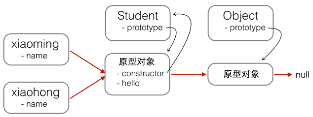

JavaScript的原型链和Java的Class区别就在，它没有“Class”的概念，所有对象都是实例，所谓继承关系不过是把一个对象的原型指向另一个对象而已。

```js
var Student = {
    name: 'Robot',
    height: 1.2,
    run: function () {
        console.log(this.name + ' is running...');
    }
};

var xiaoming = {
    name: '小明'
};

xiaoming.__proto__ = Student;
```

注意最后一行代码把xiaoming的原型指向了对象Student，看上去xiaoming仿佛是从Student继承下来的：

##请注意！！！上述代码仅用于演示目的。在编写JavaScript代码时，不要直接用obj.__proto__去改变一个对象的原型，并且，低版本的IE也无法使用__proto__。

Object.create()方法可以传入一个原型对象，并创建一个基于该原型的新对象，但是新对象什么属性都没有，因此，我们可以编写一个函数来创建xiaoming：

```js
// 原型对象:
var Student = {
    name: 'Robot',
    height: 1.2,
    run: function () {
        console.log(this.name + ' is running...');
    }
};

function createStudent(name) {
    // 基于Student原型创建一个新对象:
    var s = Object.create(Student);
    // 初始化新对象:
    s.name = name;
    return s;
}

var xiaoming = createStudent('小明');
xiaoming.run(); // 小明 is running...
xiaoming.__proto__ === Student; // true
```

---
# 原型链
当我们用obj.xxx访问一个对象的属性时，JavaScript引擎先在当前对象上查找该属性，如果没有找到，就到其原型对象上找，如果还没有找到，就一直上溯到Object.prototype对象，最后，如果还没有找到，就只能返回undefined。

例如，创建一个Array对象：

```js
var arr = [1, 2, 3];
```

其原型链是：

arr ----> Array.prototype ----> Object.prototype ----> null

Array.prototype定义了indexOf()、shift()等方法，因此你可以在所有的Array对象上直接调用这些方法。

当我们创建一个函数时：

```js
function foo() {
    return 0;
}
```

函数也是一个对象，它的原型链是：

```js
foo ----> Function.prototype ----> Object.prototype ----> null
```

---
# 构造函数
除了直接用{ ... }创建一个对象外，JavaScript还可以用一种构造函数的方法来创建对象。它的用法是，先定义一个构造函数：

```js
function Student(name) {
    this.name = name;
    this.hello = function () {
        alert('Hello, ' + this.name + '!');
    }
}
```

这确实是一个普通函数，但是在JavaScript中，可以用关键字new来调用这个函数，并返回一个对象：

```js
var xiaoming = new Student('小明');
xiaoming.name; // '小明'
xiaoming.hello(); // Hello, 小明!
```

注意，如果不写new，这就是一个普通函数，它返回undefined。但是，如果写了new，它就变成了一个构造函数，它绑定的this指向新创建的对象，并默认返回this，也就是说，不需要在最后写return this;。
又创建了xiaohong、xiaojun，那么这些对象的原型与xiaoming是一样的：

```js
xiaoming ↘
xiaohong -→ Student.prototype ----> Object.prototype ----> null
xiaojun  ↗
```

用new Student()创建的对象还从原型上获得了一个constructor属性，它指向函数Student本身：

```js
xiaoming.constructor === Student.prototype.constructor; // true
Student.prototype.constructor === Student; // true

Object.getPrototypeOf(xiaoming) === Student.prototype; // true

xiaoming instanceof Student; // true
```

看晕了吧？用一张图来表示这些乱七八糟的关系就是：


红色箭头是原型链。注意，Student.prototype指向的对象就是xiaoming、xiaohong的原型对象，这个原型对象自己还有个属性constructor，指向Student函数本身。

另外，函数Student恰好有个属性prototype指向xiaoming、xiaohong的原型对象，但是xiaoming、xiaohong这些对象可没有prototype这个属性，不过可以用__proto__这个非标准用法来查看。

现在我们就认为xiaoming、xiaohong这些对象“继承”自Student。

还有一个小问题，注意观察：

```js
xiaoming.name; // '小明'
xiaohong.name; // '小红'
xiaoming.hello; // function: Student.hello()
xiaohong.hello; // function: Student.hello()
xiaoming.hello === xiaohong.hello; // false
```

xiaoming和xiaohong各自的name不同，这是对的，否则我们无法区分谁是谁了。

xiaoming和xiaohong各自的hello是一个函数，但它们是两个不同的函数，虽然函数名称和代码都是相同的！

如果我们通过new Student()创建了很多对象，这些对象的hello函数实际上只需要共享同一个函数就可以了，这样可以节省很多内存。

要让创建的对象共享一个hello函数，根据对象的属性查找原则，我们只要把hello函数移动到xiaoming、xiaohong这些对象共同的原型上就可以了，也就是Student.prototype：


修改代码如下：

```js
function Student(name) {
    this.name = name;
}

Student.prototype.hello = function () {
    alert('Hello, ' + this.name + '!');
};
```

# 忘记写new怎么办
在strict模式下，this.name = name将报错，因为this绑定为undefined，在非strict模式下，this.name = name不报错，因为this绑定为window，于是无意间创建了全局变量name，并且返回undefined，这个结果更糟糕。

所以，调用构造函数千万不要忘记写new。为了区分普通函数和构造函数，按照约定，构造函数首字母应当大写，而普通函数首字母应当小写，这样，一些语法检查工具如jslint将可以帮你检测到漏写的new。

最后，我们还可以编写一个createStudent()函数，在内部封装所有的new操作。一个常用的编程模式像这样：

```js
function Student(props) {
    this.name = props.name || '匿名'; // 默认值为'匿名'
    this.grade = props.grade || 1; // 默认值为1
}

Student.prototype.hello = function () {
    alert('Hello, ' + this.name + '!');
};

function createStudent(props) {
    return new Student(props || {})
}
```

这个createStudent()函数有几个巨大的优点：一是不需要new来调用，二是参数非常灵活，可以不传，也可以这么传：

```js
var xiaoming = createStudent({
    name: '小明'
});

xiaoming.grade; // 1
```

如果创建的对象有很多属性，我们只需要传递需要的某些属性，剩下的属性可以用默认值。由于参数是一个Object，我们无需记忆参数的顺序。如果恰好从JSON拿到了一个对象，就可以直接创建出xiaoming。

---
# 原型继承
Student构造函数：

```js
function Student(props) {
    this.name = props.name || 'Unnamed';
}

Student.prototype.hello = function () {
    alert('Hello, ' + this.name + '!');
}
```

Student的原型链：

要基于Student扩展出PrimaryStudent，可以先定义出PrimaryStudent：

```js
function PrimaryStudent(props) {
    // 调用Student构造函数，绑定this变量:
    Student.call(this, props);
    this.grade = props.grade || 1;
}
```

但是，调用了Student构造函数不等于继承了Student，PrimaryStudent创建的对象的原型是：

```js
new PrimaryStudent() ----> PrimaryStudent.prototype ----> Object.prototype ----> null
```

必须想办法把原型链修改为：

```js
new PrimaryStudent() ----> PrimaryStudent.prototype ----> Student.prototype ----> Object.prototype ----> null
```

必须借助一个中间对象来实现正确的原型链，这个中间对象的原型要指向Student.prototype。中间对象可以用一个空函数F来实现：

```js
// PrimaryStudent构造函数:
function PrimaryStudent(props) {
    Student.call(this, props);
    this.grade = props.grade || 1;
}

// 空函数F:
function F() {
}

// 把F的原型指向Student.prototype:
F.prototype = Student.prototype;

// 把PrimaryStudent的原型指向一个新的F对象，F对象的原型正好指向Student.prototype:
PrimaryStudent.prototype = new F();

// 把PrimaryStudent原型的构造函数修复为PrimaryStudent:
PrimaryStudent.prototype.constructor = PrimaryStudent;

// 继续在PrimaryStudent原型（就是new F()对象）上定义方法：
PrimaryStudent.prototype.getGrade = function () {
    return this.grade;
};

// 创建xiaoming:
var xiaoming = new PrimaryStudent({
    name: '小明',
    grade: 2
});
xiaoming.name; // '小明'
xiaoming.grade; // 2

// 验证原型:
xiaoming.__proto__ === PrimaryStudent.prototype; // true
xiaoming.__proto__.__proto__ === Student.prototype; // true

// 验证继承关系:
xiaoming instanceof PrimaryStudent; // true
xiaoming instanceof Student; // true
```

用一张图来表示新的原型链：

函数F仅用于桥接，我们仅创建了一个new F()实例，而且，没有改变原有的Student定义的原型链。

如果把继承这个动作用一个inherits()函数封装起来，还可以隐藏F的定义，并简化代码：

```js
function inherits(Child, Parent) {
    var F = function () {};
    F.prototype = Parent.prototype;
    Child.prototype = new F();
    Child.prototype.constructor = Child;
}
```

这个inherits()函数可以复用：

```js
function Student(props) {
    this.name = props.name || 'Unnamed';
}

Student.prototype.hello = function () {
    alert('Hello, ' + this.name + '!');
}

function PrimaryStudent(props) {
    Student.call(this, props);
    this.grade = props.grade || 1;
}

// 实现原型继承链:
inherits(PrimaryStudent, Student);

// 绑定其他方法到PrimaryStudent原型:
PrimaryStudent.prototype.getGrade = function () {
    return this.grade;
};
```

JavaScript的原型继承实现方式就是：
定义新的构造函数，并在内部用call()调用希望“继承”的构造函数，并绑定this；
借助中间函数F实现原型链继承，最好通过封装的inherits函数完成；
继续在新的构造函数的原型上定义新方法。

---
# class继承
新的关键字class从ES6开始正式被引入到JavaScript中。

```js
class Student {
    constructor(name) {
        this.name = name;
    }

    hello() {
        alert('Hello, ' + this.name + '!');
    }
}
```

于是，继承就简单了。

```js
class PrimaryStudent extends Student {
    constructor(name, grade) { // 如果参数相同，constructor可以省略
        super(name); // 记得用super调用父类的构造方法!
        this.grade = grade;
    }

    myGrade() {
        alert('I am at grade ' + this.grade);
    }
}
```

因为不是所有的主流浏览器都支持ES6的class。如果一定要现在就用上，就需要一个工具把class代码转换为传统的prototype代码，可以试试[Babel](https://babeljs.io)这个工具。


